# Vera en diagramas

La [arquitectura pública](https://vera.mediafranca.net/vera-arquitectura/)
ofrece la entrada conceptual. Estos diagramas documentan la implementación y
las propuestas técnicas con mayor detalle.

> Los diagramas describen estructura y recorridos, no el resultado de una
> corrida. `npm run spec`, `npm run typecheck` y `npm test` son la autoridad para
> el estado actual.
>
> **Qué cambió desde la primera versión de esta página.** Lo retenido dejó de ser
> el plan B y pasó a dibujarse siempre; detrás va una pregunta barata al registro;
> lo que otra mano escribió se anuncia y espera a que lo pulsen; y un desacuerdo
> entre dos manos se resuelve bloque a bloque. Ver
> [15](#15-leer-lo-retenido-primero), [16](#16-lo-que-espera-y-quién-decide-traerlo)
> y [17](#17-el-desacuerdo).
>
> **Qué manda y qué no.** Las especificaciones de [`specs/`](../specs/) son la
> fuente de verdad sobre el comportamiento; esta página **describe la forma que
> tomó el código al cumplirlas**. Si un diagrama y una spec se contradicen, manda
> la spec y el diagrama está desactualizado. Nada de aquí crea comportamiento.
>
> **Lo construido y lo propuesto se marcan por separado.** Los nodos con borde
> punteado y la sección [Lo que todavía no existe](#lo-que-todavía-no-existe) son
> intención; todo lo demás está en el árbol y tiene pruebas.

Los diagramas son Mermaid, que GitHub renderiza directamente y que la propia
Vera sabe dibujar dentro de un bloque —ver `packages/web/src/mermaid.ts`—, así
que este documento se puede pegar en el corpus y seguir leyéndose igual.

---

## Índice

**El sistema visto desde fuera**
1. [El sistema y quienes lo tocan](#1-el-sistema-y-quienes-lo-tocan)
2. [Los paquetes y qué depende de qué](#2-los-paquetes-y-qué-depende-de-qué)
3. [Casos de uso, por actor](#3-casos-de-uso-por-actor)

**El dominio**

4. [Mapa de clases del núcleo](#4-mapa-de-clases-del-núcleo)
5. [El vocabulario de cambio](#5-el-vocabulario-de-cambio)
6. [Procedencia: quién, por dónde y con qué prueba](#6-procedencia-quién-por-dónde-y-con-qué-prueba)
7. [Lo que se deriva del texto](#7-lo-que-se-deriva-del-texto)
8. [Ontología, propiedades y sus nombres](#8-ontología-propiedades-y-sus-nombres)
9. [Recorridos, cruces y relaciones explicadas](#9-recorridos-cruces-y-relaciones-explicadas)
10. [Tareas, glosas, dibujos y listas](#10-tareas-glosas-dibujos-y-listas)

**La persistencia**

11. [El esquema, por regiones](#11-el-esquema-por-regiones)
12. [Registro canónico y materialización](#12-registro-canónico-y-materialización)

**Los caminos**

13. [El camino de una escritura](#13-el-camino-de-una-escritura)
14. [Estados de un cambio pendiente](#14-estados-de-un-cambio-pendiente)
15. [Leer: lo retenido primero](#15-leer-lo-retenido-primero)
16. [Lo que espera, y quién decide traerlo](#16-lo-que-espera-y-quién-decide-traerlo)
17. [El desacuerdo](#17-el-desacuerdo)
18. [La espera, cuando la hay](#18-la-espera-cuando-la-hay)
19. [Deshacer](#19-deshacer)
20. [La puerta MCP](#20-la-puerta-mcp)
21. [El cerco de una credencial](#21-el-cerco-de-una-credencial)
22. [Importación y proyección](#22-importación-y-proyección)
23. [Búsqueda y consultas](#23-búsqueda-y-consultas)
24. [Procesar una página](#24-procesar-una-página)
25. [La voz](#25-la-voz)
26. [Servicios de fuera](#26-servicios-de-fuera)

**La superficie**

27. [La PWA por dentro](#27-la-pwa-por-dentro)
28. [Las rutas HTTP](#28-las-rutas-http)

**El método**

29. [De la spec al código](#29-de-la-spec-al-código)
30. [Lo que todavía no existe](#lo-que-todavía-no-existe)

---

## 1. El sistema y quienes lo tocan

Vera corre en la máquina de una persona. Todo lo que aparece afuera es
opcional, y casi todo es de sólo lectura o de sólo entrada: el corpus no sale
para ser entendido, y lo que entra entra por una sola puerta.

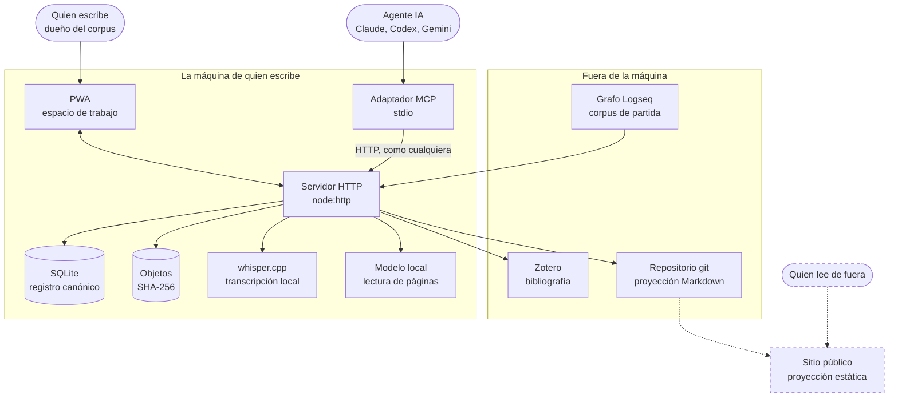
```mermaid
flowchart TB
    subgraph fuera["Fuera de la máquina"]
        zotero["Zotero<br/>bibliografía"]
        git["Repositorio git<br/>proyección Markdown"]
        logseq["Grafo Logseq<br/>corpus de partida"]
    end

    subgraph maquina["La máquina de quien escribe"]
        direction TB
        pwa["PWA<br/>espacio de trabajo"]
        srv["Servidor HTTP<br/>node:http"]
        db[("SQLite<br/>registro canónico")]
        obj[("Objetos<br/>SHA-256")]
        whisper["whisper.cpp<br/>transcripción local"]
        modelo["Modelo local<br/>lectura de páginas"]
        mcpd["Adaptador MCP<br/>stdio"]
    end

    duenio(["Quien escribe<br/>dueño del corpus"])
    agente(["Agente IA<br/>Claude, Codex, Gemini"])

    duenio --> pwa
    pwa <--> srv
    srv --> db
    srv --> obj
    srv --> whisper
    srv --> modelo
    srv --> zotero
    srv --> git
    logseq --> srv
    agente --> mcpd
    mcpd -->|"HTTP, como cualquiera"| srv

    sitio["Sitio público<br/>proyección estática"]
    lector(["Quien lee de fuera"])
    git -.-> sitio
    lector -.-> sitio

    classDef propuesta stroke-dasharray: 5 5
    class sitio,lector propuesta
```

Tres cosas que el diagrama afirma y conviene leer despacio:

- **El adaptador MCP no abre la base.** Podría —está en el mismo disco— y sería
  el error. `@invariant MCPIsADoorAndNotASecondMemory`: todo lo que MCP contesta
  sale de la API, que es donde viven la autoría, la autorización y el registro
  de exposición.
- **La transcripción y la lectura de páginas corren en casa.** `@invariant
  TheModelIsLocalOrThereIsNone`: donde no haya modelo se hace la parte que no lo
  necesita y se dice cuál no se pudo.
- **Git recibe una proyección, no la base.** El archivo SQLite activo y sus WAL
  no son historial de git.

---

## 2. Los paquetes y qué depende de qué

Monorepo de npm workspaces, seis paquetes. Las flechas son dependencias reales
medidas sobre los `import`, no un dibujo de intenciones.

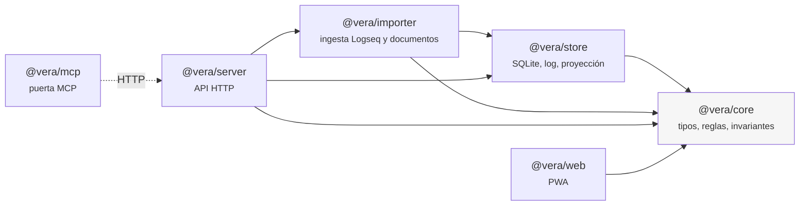
```mermaid
flowchart LR
    core["@vera/core<br/><small>tipos, reglas, invariantes</small>"]
    store["@vera/store<br/><small>SQLite, log, proyección</small>"]
    importer["@vera/importer<br/><small>ingesta Logseq y documentos</small>"]
    server["@vera/server<br/><small>API HTTP</small>"]
    web["@vera/web<br/><small>PWA</small>"]
    mcp["@vera/mcp<br/><small>puerta MCP</small>"]

    store --> core
    importer --> core
    importer --> store
    server --> core
    server --> store
    server --> importer
    web --> core
    mcp -.->|"HTTP"| server

    classDef sinDeps fill:#f6f6f6
    class core sinDeps
```

- **`@vera/core` no depende de nada**, ni siquiera de `node:`. Por eso el mismo
  dominio que corre en el servidor corre en el navegador: la réplica local es un
  `VeraGraph` de verdad, no una segunda implementación de las reglas.
- **`@vera/mcp` no importa ningún paquete de Vera.** Habla por HTTP, como
  cualquier cliente de fuera. Es lo que hace que la puerta sea una puerta.
- **Las dependencias de ejecución viven todas en la PWA**: `d3`, `d3-force-3d`,
  `mermaid` y las fuentes IBM Plex. Los cuatro paquetes de servidor y dominio no
  tienen ninguna. (`architecture.md` todavía nombra `3d-force-graph` y `three`;
  el mapa 3D ya no los usa.)

---

## Vera Desktop y Vera Conecta

El conector pertenece a Desktop. Vera Conecta conserva el contrato y el estado
mínimo del relay, pero nunca abre la biblioteca ni custodia credenciales de
VERA. La página [[VERA: Conexiones]] es la superficie humana de este recorrido.

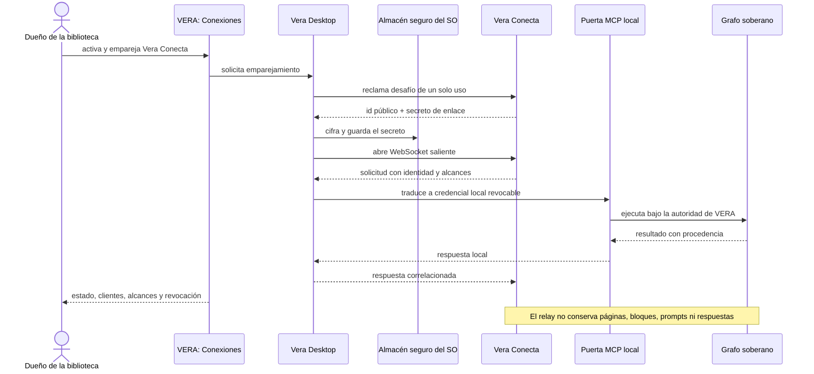
```mermaid
sequenceDiagram
    actor D as Dueño de la biblioteca
    participant UI as VERA: Conexiones
    participant Desktop as Vera Desktop
    participant Seguro as Almacén seguro del SO
    participant Relay as Vera Conecta
    participant MCP as Puerta MCP local
    participant G as Grafo soberano

    D->>UI: activa y empareja Vera Conecta
    UI->>Desktop: solicita emparejamiento
    Desktop->>Relay: reclama desafío de un solo uso
    Relay-->>Desktop: id público + secreto de enlace
    Desktop->>Seguro: cifra y guarda el secreto
    Desktop->>Relay: abre WebSocket saliente
    Relay-->>Desktop: solicitud con identidad y alcances
    Desktop->>MCP: traduce a credencial local revocable
    MCP->>G: ejecuta bajo la autoridad de VERA
    G-->>MCP: resultado con procedencia
    MCP-->>Desktop: respuesta local
    Desktop-->>Relay: respuesta correlacionada
    UI-->>D: estado, clientes, alcances y revocación

    Note over Relay,G: El relay no conserva páginas, bloques, prompts ni respuestas
```

La activación se rechaza si Desktop no dispone de un almacén seguro real. La
caída de red no abre puertos: el enlace siempre se inicia desde Desktop y se
reconecta con espera exponencial. Al cerrar Desktop se cancelan el socket, los
latidos y cualquier reintento.

---

## 3. Casos de uso, por actor

Las specs declaran 26 `actor` y 40 `surface`. Lo que sigue son los cuatro
actores con superficie construida, agrupados por lo que cada uno puede hacer.
Un caso de uso aquí es una capacidad que alguna `surface` expone, no una
pantalla.

### Quien escribe

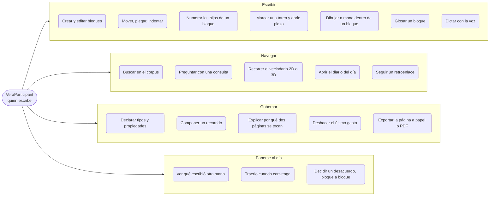
```mermaid
flowchart LR
    p(["VeraParticipant<br/>quien escribe"])

    subgraph escribir["Escribir"]
        u1("Crear y editar bloques")
        u2("Mover, plegar, indentar")
        u3("Numerar los hijos de un bloque")
        u4("Marcar una tarea y darle plazo")
        u5("Dibujar a mano dentro de un bloque")
        u6("Glosar un bloque")
        u7("Dictar con la voz")
    end

    subgraph navegar["Navegar"]
        u8("Buscar en el corpus")
        u9("Preguntar con una consulta")
        u10("Recorrer el vecindario 2D o 3D")
        u11("Abrir el diario del día")
        u12("Seguir un retroenlace")
    end

    subgraph gobernar["Gobernar"]
        u13("Declarar tipos y propiedades")
        u14("Componer un recorrido")
        u15("Explicar por qué dos páginas se tocan")
        u16("Deshacer el último gesto")
        u17("Exportar la página a papel o PDF")
    end

    subgraph aldia["Ponerse al día"]
        u18("Ver qué escribió otra mano")
        u19("Traerlo cuando convenga")
        u20("Decidir un desacuerdo, bloque a bloque")
    end

    p --> escribir
    p --> navegar
    p --> gobernar
    p --> aldia
```

### El dueño del corpus

Lo que sólo hace el dueño, y por qué está aparte: administrar credenciales es
lo único que no se hace *con* una credencial. `@invariant
SovereignOwnerCredentials` — un portador de credencial no se emite otra.

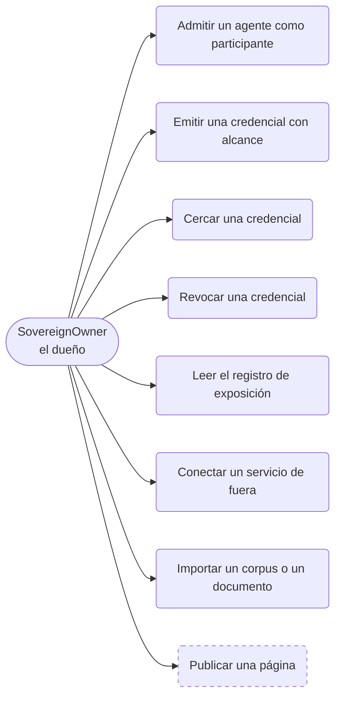
```mermaid
flowchart LR
    o(["SovereignOwner<br/>el dueño"])

    o --> c1("Admitir un agente como participante")
    o --> c2("Emitir una credencial con alcance")
    o --> c3("Cercar una credencial")
    o --> c4("Revocar una credencial")
    o --> c5("Leer el registro de exposición")
    o --> c6("Conectar un servicio de fuera")
    o --> c7("Importar un corpus o un documento")
    o --> c8("Publicar una página")

    classDef propuesta stroke-dasharray: 5 5
    class c8 propuesta
```

### Un agente

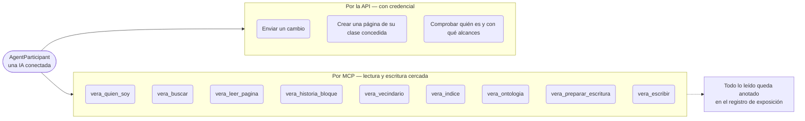
```mermaid
flowchart LR
    a(["AgentParticipant<br/>una IA conectada"])

    subgraph mcp["Por MCP — lectura y escritura cercada"]
        m1("vera_quien_soy")
        m2("vera_buscar")
        m3("vera_leer_pagina")
        m4("vera_historia_bloque")
        m5("vera_vecindario")
        m6("vera_indice")
        m7("vera_ontologia")
        m8("vera_preparar_escritura")
        m9("vera_escribir")
    end

    subgraph escritura["Por la API — con credencial"]
        w1("Enviar un cambio")
        w2("Crear una página de su clase concedida")
        w3("Comprobar quién es y con qué alcances")
    end

    a --> mcp
    a --> escritura

    nota["Todo lo leído queda anotado<br/>en el registro de exposición"]
    mcp -.-> nota
```

MCP ofrece siete herramientas de lectura y dos para preparar y aplicar escritura
no destructiva. Cada cambio usa la misma puerta canónica de operaciones y queda
atribuido a la credencial del agente.

### Casos de uso y qué spec los gobierna

| Caso | Spec | Superficie |
| --- | --- | --- |
| Escribir un bloque | `block-editing.allium` | `BlockEditor` |
| Aplicar un cambio | `change-application.allium` | `GraphChangeHistory` |
| Trabajar sin red | `offline-reconciliation.allium` | `LocalFirstWorkspace` |
| Ponerse al día | `offline-reconciliation.allium` | `LocalFirstWorkspace` |
| Decidir un desacuerdo | `offline-reconciliation.allium` | `LocalFirstWorkspace` |
| Buscar | `search-index.allium` | `GraphSearchAccess` |
| Preguntar | `query-language.allium` | `GraphQuerying` |
| Recorrer el grafo | `graph-navigation.allium` | `GraphNavigation` |
| Componer un recorrido | `trail.allium` | `TrailComposition` |
| Dictar | `voice-capture.allium` | `VoiceCapture` |
| Dibujar | `hand-drawing.allium` | `Drawable` |
| Glosar | `block-gloss.allium` | `BlockGloss` |
| Declarar el vocabulario | `controlled-ontology.allium` | `OntologyCuration` |
| Credenciales | `agent-participation.allium` | `CredentialAdministration` |
| Cercar | `confined-writing.allium` | `ConfinementAdministration` |
| Puerta MCP | `mcp-server.allium` | `MemoryOverMCP` |
| Servicios de fuera | `service-connections.allium` | `ServicePage` |
| Deshacer | `undo.allium` | `Undoable` |
| Papel y PDF | `page-on-paper.allium` | `PageExport` |
| Esperar | `waiting.allium` | `WaitIndication` |

---

## 4. Mapa de clases del núcleo

Traducido 1:1 desde `specs/core.allium`. Los campos de las specs son
`snake_case` y la superficie TypeScript es `camelCase`; la correspondencia es
uno a uno y está en `packages/core/src/types.ts`.

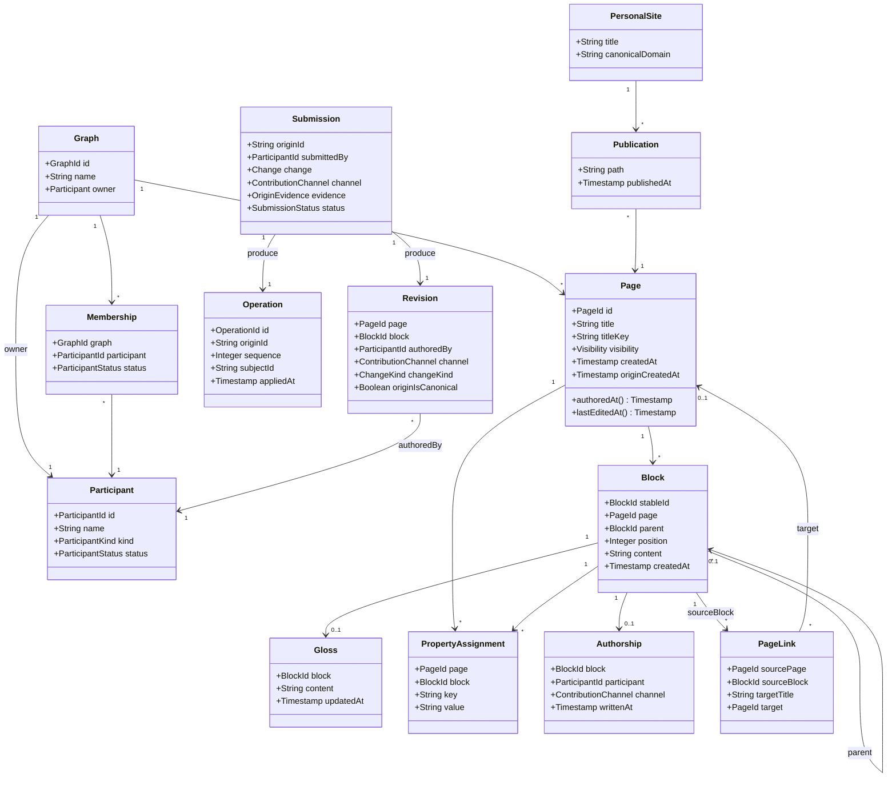
```mermaid
classDiagram
    class Participant {
        +ParticipantId id
        +String name
        +ParticipantKind kind
        +ParticipantStatus status
    }

    class Graph {
        +GraphId id
        +String name
        +Participant owner
    }

    class Membership {
        +GraphId graph
        +ParticipantId participant
        +ParticipantStatus status
    }

    class Page {
        +PageId id
        +String title
        +String titleKey
        +Visibility visibility
        +Timestamp createdAt
        +Timestamp originCreatedAt
        +authoredAt() Timestamp
        +lastEditedAt() Timestamp
    }

    class Block {
        +BlockId stableId
        +PageId page
        +BlockId parent
        +Integer position
        +String content
        +Timestamp createdAt
    }

    class Gloss {
        +BlockId block
        +String content
        +Timestamp updatedAt
    }

    class PropertyAssignment {
        +PageId page
        +BlockId block
        +String key
        +String value
    }

    class Submission {
        +String originId
        +ParticipantId submittedBy
        +Change change
        +ContributionChannel channel
        +OriginEvidence evidence
        +SubmissionStatus status
    }

    class Operation {
        +OperationId id
        +String originId
        +Integer sequence
        +String subjectId
        +Timestamp appliedAt
    }

    class Revision {
        +PageId page
        +BlockId block
        +ParticipantId authoredBy
        +ContributionChannel channel
        +ChangeKind changeKind
        +Boolean originIsCanonical
    }

    class Authorship {
        +BlockId block
        +ParticipantId participant
        +ContributionChannel channel
        +Timestamp writtenAt
    }

    class PageLink {
        +PageId sourcePage
        +BlockId sourceBlock
        +String targetTitle
        +PageId target
    }

    class PersonalSite {
        +String title
        +String canonicalDomain
    }

    class Publication {
        +String path
        +Timestamp publishedAt
    }

    Graph "1" --> "1" Participant : owner
    Graph "1" --> "*" Membership
    Membership "*" --> "1" Participant
    Graph "1" --> "*" Page
    Page "1" --> "*" Block
    Block "0..1" --> "*" Block : parent
    Block "1" --> "0..1" Gloss
    Block "1" --> "0..1" Authorship
    Page "1" --> "*" PropertyAssignment
    Block "1" --> "*" PropertyAssignment
    Submission "1" --> "1" Operation : produce
    Submission "1" --> "1" Revision : produce
    Revision "*" --> "1" Participant : authoredBy
    Block "1" --> "*" PageLink : sourceBlock
    PageLink "*" --> "0..1" Page : target
    PersonalSite "1" --> "*" Publication
    Publication "*" --> "1" Page
```

Lo que este mapa fija, y que ningún otro documento repite:

- **`stableId` es la identidad que sobrevive a editar y a mover.** Nunca se
  reasigna. `@invariant BlockStableIdentityIsUnique`.
- **`titleKey` normaliza mayúsculas y acentos.** El corpus escribe `[[LogSeq]]`
  y `[[Logseq]]` para una sola página, y resolverlas por separado partiría el
  grafo en pedazos falsos. `@invariant PageTitleIsUniqueWithinGraph` opera sobre
  la clave, no sobre el título.
- **`authoredAt` puede ser un techo.** Sin fecha de origen lo único que se sabe
  es que la página no se escribió después de entrar, y `authoredAtIsCeiling` lo
  dice en vez de afirmar un día que nadie comprobó.
- **`lastEditedAt` no se almacena**: se deriva del registro. Dos copias del
  mismo dato son dos ocasiones de discrepar.
- **Una propiedad recae sobre una página o sobre un bloque, nunca sobre las
  dos.** `@invariant PropertyTargetsOneSubject`, sostenido en el esquema por un
  `CHECK ((page_id IS NULL) <> (block_id IS NULL))`.
- **`Authorship` y `Revision` no son lo mismo.** La autoría dice de qué mano
  salió el texto que el bloque tiene *ahora* y cambia con cada edición; la
  revisión es un hecho del pasado que no cambia nunca.

---

## 5. El vocabulario de cambio

Doce clases de cambio y ni una más. Es el vocabulario entero por el que el
corpus puede moverse: no hay una segunda puerta de escritura, y nada fuera de
`submitOperation()` escribe en las tablas de estado.

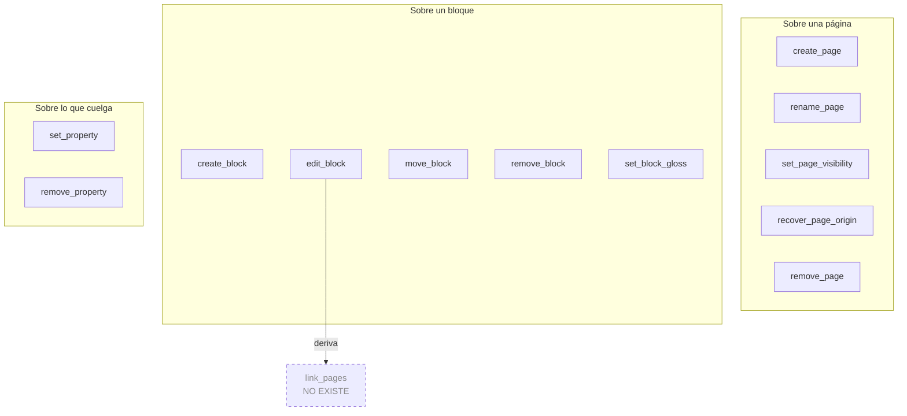
```mermaid
flowchart TB
    subgraph paginas["Sobre una página"]
        cp["create_page"]
        rp["rename_page"]
        sv["set_page_visibility"]
        ro["recover_page_origin"]
        xp["remove_page"]
    end

    subgraph bloques["Sobre un bloque"]
        cb["create_block"]
        eb["edit_block"]
        mb["move_block"]
        xb["remove_block"]
        sg["set_block_gloss"]
    end

    subgraph props["Sobre lo que cuelga"]
        sp["set_property"]
        xr["remove_property"]
    end

    nolink["link_pages<br/>NO EXISTE"]
    eb -->|"deriva"| nolink

    classDef ausente stroke-dasharray: 5 5,color:#888
    class nolink ausente
```

**`link_pages` no es una clase de cambio y no lo será.** Los enlaces se derivan
del contenido del bloque: existen exactamente mientras el texto los diga. Un
participante que pudiera enviarlos podría dejar en el grafo un enlace que el
texto no dice, y entonces el grafo dejaría de ser una lectura del corpus para
ser una segunda afirmación sobre él.

Qué campos exige cada clase está en `change-application.allium`; el resumen
operativo es que **quien crea puede proponer la identidad de lo creado**
(`stableId`), y eso no es un detalle:

- la importación lo usa para adoptar los identificadores que el corpus traía de
  Logseq, en vez de inventar otros y romper referencias que existían fuera;
- el cliente local lo usa para poder nombrar lo que crea sin preguntar, que es
  lo que permite que la mano no espere a la red.

---

## 6. Procedencia: quién, por dónde y con qué prueba

Seis canales de contribución. No son «cómo entró el contenido»: son de dónde
viene, en un corpus donde también escriben máquinas.

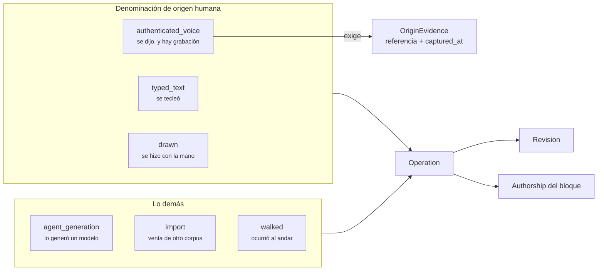
```mermaid
flowchart LR
    subgraph humano["Denominación de origen humana"]
        t["typed_text<br/><small>se tecleó</small>"]
        v["authenticated_voice<br/><small>se dijo, y hay grabación</small>"]
        d["drawn<br/><small>se hizo con la mano</small>"]
    end

    subgraph otros["Lo demás"]
        a["agent_generation<br/><small>lo generó un modelo</small>"]
        i["import<br/><small>venía de otro corpus</small>"]
        w["walked<br/><small>ocurrió al andar</small>"]
    end

    v -->|"exige"| e["OriginEvidence<br/>referencia + captured_at"]

    humano --> op["Operation"]
    otros --> op
    op --> rev["Revision"]
    op --> auth["Authorship del bloque"]
```

- **`authenticated_voice` sin prueba se rechaza.** `@invariant
  VoiceCanonicalityRequiresEvidence`, sostenido también en el esquema:
  `CHECK (channel <> 'authenticated_voice' OR evidence_reference IS NOT NULL)`.
- **La voz autenticada prueba autoría, no verdad factual.** `originIsCanonical`
  dice que estas palabras salieron de esta persona, no que sean ciertas.
- **`walked` es el que menos se parece a los otros.** No se tecleó, no se dijo y
  no lo generó nadie: es lo que alguien produjo andando por el corpus —el
  testimonio de un cruce—. Admitirlo es afirmar que caminar es producir. La
  alternativa era que Vera firmara ese texto, y entonces habría bloques en el
  corpus que ningún participante puso.
- **Todo bloque tiene autoría.** `@invariant
  GeneratedContentIsAlwaysDistinguishable`: saber si un pasaje se escribió o se
  generó nunca obliga a recorrer el registro.

---

## 7. Lo que se deriva del texto

Todo lo derivado del contenido de un bloque se calcula en un solo lugar
—`packages/core/src/text.ts`— para que los índices no puedan discrepar del
contenido.

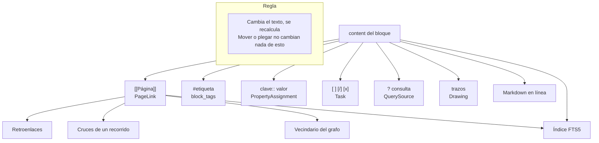
```mermaid
flowchart TB
    c["content del bloque"]

    c --> l["[[Página]]<br/>PageLink"]
    c --> t["#etiqueta<br/>block_tags"]
    c --> k["clave:: valor<br/>PropertyAssignment"]
    c --> m["[ ] [/] [x]<br/>Task"]
    c --> q["? consulta<br/>QuerySource"]
    c --> dr["trazos<br/>Drawing"]
    c --> md["Markdown en línea"]

    l --> bl["Retroenlaces"]
    l --> cr["Cruces de un recorrido"]
    l --> nb["Vecindario del grafo"]
    l --> fts["Índice FTS5"]
    c --> fts

    subgraph reglaClave["Regla"]
        r["Cambia el texto, se recalcula<br/>Mover o plegar no cambian nada de esto"]
    end
```

`@invariant RenderingFollowsChangedMeaning`: lo derivado se recalcula cuando
cambiaron sus entradas, y no porque algo pasara. Mover un bloque no cambia a
quién nombra la página, así que los retroenlaces siguen siendo ciertos. La
réplica local usa exactamente esta distinción para saber cuándo lo que trajo el
servidor quedó sucio y cuándo no.

Un enlace puede apuntar a una página que aún no existe. Esos enlaces esperan:
`page_links.target_id` queda nulo y hay un índice parcial —`links_waiting`— para
resolverlos en cuanto la página nazca.

---

## 8. Ontología, propiedades y sus nombres

El vocabulario lo pone el dueño, no el código. Hay un puñado de propiedades
sobre las que Vera necesita decir algo —cuál dice de qué clase es una página,
cuál de qué trata, cuáles llevan una relación explicada— y esas palabras **no
están escritas dentro del código**: están en dos páginas del corpus, y el código
las lee de ahí.

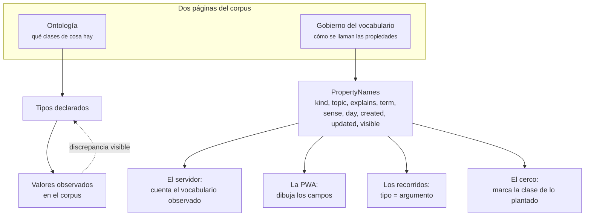
```mermaid
flowchart TB
    subgraph corpus["Dos páginas del corpus"]
        onto["Ontología<br/><small>qué clases de cosa hay</small>"]
        gob["Gobierno del vocabulario<br/><small>cómo se llaman las propiedades</small>"]
    end

    gob --> names["PropertyNames<br/>kind, topic, explains, term,<br/>sense, day, created, updated, visible"]

    names --> srv["El servidor:<br/>cuenta el vocabulario observado"]
    names --> web["La PWA:<br/>dibuja los campos"]
    names --> trail["Los recorridos:<br/>tipo = argumento"]
    names --> fence["El cerco:<br/>marca la clase de lo plantado"]

    onto --> decl["Tipos declarados"]
    decl --> obs["Valores observados<br/>en el corpus"]
    obs -.->|"discrepancia visible"| decl
```

Dos afirmaciones que sostienen esto:

- **`@invariant TheOntologyIsWrittenWhereItCanBeRead`** — el vocabulario vive en
  páginas, no en un archivo de configuración. Todo lo gobernable de Vera vive en
  páginas; la única excepción es un secreto.
- **Lo declarado y lo observado se enseñan juntos.** Una propiedad que el corpus
  usa y la ontología no declara es información, no un error que haya que
  esconder.

---

## 9. Recorridos, cruces y relaciones explicadas

Un recorrido es **una página con `tipo:: argumento`**, y nada más. No hay
entidad que mantener ni tabla nueva: los nodos son las referencias que su texto
lleva, en el orden en que se leen; las conectivas son lo que queda del texto
cuando se le quitan las referencias; los cruces son los pares consecutivos. Un
recorrido de siete nodos tiene seis cruces, y ninguno está guardado.

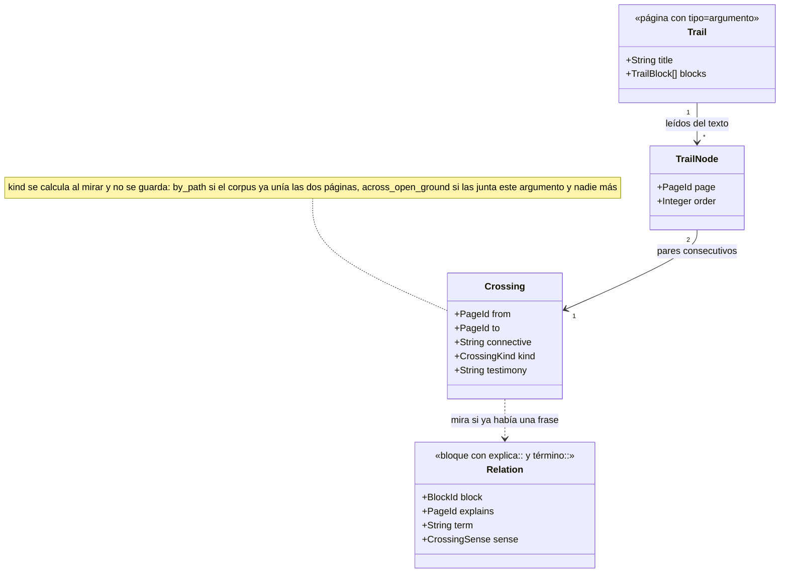
```mermaid
classDiagram
    class Trail {
        <<página con tipo=argumento>>
        +String title
        +TrailBlock[] blocks
    }
    class TrailNode {
        +PageId page
        +Integer order
    }
    class Crossing {
        +PageId from
        +PageId to
        +String connective
        +CrossingKind kind
        +String testimony
    }
    class Relation {
        <<bloque con explica:: y término::>>
        +BlockId block
        +PageId explains
        +String term
        +CrossingSense sense
    }

    Trail "1" --> "*" TrailNode : leídos del texto
    TrailNode "2" --> "1" Crossing : pares consecutivos
    Crossing ..> Relation : mira si ya había una frase

    note for Crossing "kind se calcula al mirar y no se guarda: by_path si el corpus ya unía las dos páginas, across_open_ground si las junta este argumento y nadie más"
```

De ahí sale `@invariant AnyPageCouldBeSeenAsAThread`, que no es una observación
bonita sino una identidad: toda página tiene referencias en un orden y texto
entre ellas. Declararla recorrido no crea nada —no reordena, no toca una
referencia, no cambia el mapa de nadie—; lo único que cambia es que a partir de
ahí ese orden se puede leer como ruta, porque alguien dijo que era a propósito.

Las dos caras de un cruce, que conviene no confundir:

| | Quién la pone | Se guarda | Cambia |
| --- | --- | --- | --- |
| **Conectiva** | el guía, escribiéndola | sí, es el texto del bloque | sólo si la reescriben |
| **Clase del cruce** | el grafo, mirando | no, se calcula al mirar | sola, cuando el corpus alcanza al argumento |
| **Testimonio** (`cruzado::`) | la promoción de un rastro | sí, como propiedad | se borra como cualquier cosa escrita |

Una **relación explicada** es lo mismo a escala de un bloque: por qué esta
página y aquélla se tocan, escrito como un bloque que cuelga de aquel desde el
que se afirma. Es un bloque y no una tabla, y de ahí sale gratis todo lo demás:
se edita, se dicta, conserva de qué mano salió, se busca y viaja en la
proyección Markdown.

---

## 10. Tareas, glosas, dibujos y listas

Cuatro cosas que parecen entidades y no lo son. Todas viven en el texto o en una
propiedad de un bloque que ya existe, y esa decisión se repite tanto que
conviene verla junta:

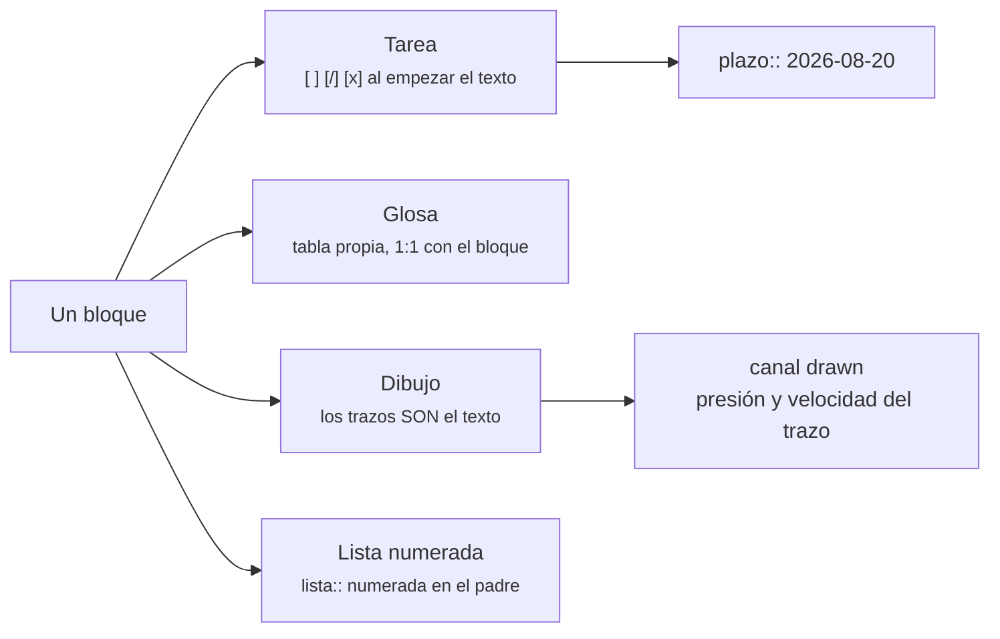
```mermaid
flowchart LR
    b["Un bloque"]

    b --> task["Tarea<br/><small>[ ] [/] [x] al empezar el texto</small>"]
    b --> gloss["Glosa<br/><small>tabla propia, 1:1 con el bloque</small>"]
    b --> draw["Dibujo<br/><small>los trazos SON el texto</small>"]
    b --> list["Lista numerada<br/><small>lista:: numerada en el padre</small>"]

    task --> tp["plazo:: 2026-08-20"]
    draw --> dp["canal drawn<br/>presión y velocidad del trazo"]
```

- **La marca de una tarea vive en el texto**, no en una propiedad. De ahí sale
  que la proyección Markdown resulte ser una lista de tareas de Markdown sin
  hacer nada, y que marcar una tarea sea editar un bloque y por tanto se
  deshaga como cualquier otra edición.
- **El número de una lista vive en el padre**, no en cada hijo. Es el caso
  contrario y por la razón contraria: la marca de una tarea es un hecho del
  ítem; el número de una lista es una consecuencia de su posición, y guardarlo
  en cada hijo obligaría a reescribir todos al insertar uno.
- **Un dibujo es un bloque cuyo texto son sus trazos.** No hay archivo aparte ni
  tabla aparte: así hereda la historia del bloque, el deshacer y la proyección.
- **La glosa sí tiene tabla propia**, porque es la única marginalia canónica y
  no es contenido del bloque: no se busca junto a él, se busca aparte
  (`glosses_fts`).

---

## 11. El esquema, por regiones

`schema/schema.sql` es un solo archivo con la correspondencia entre cada tabla y
la spec que la gobierna anotada en el encabezado. Se dibuja por regiones porque
entero no se lee.

### Núcleo

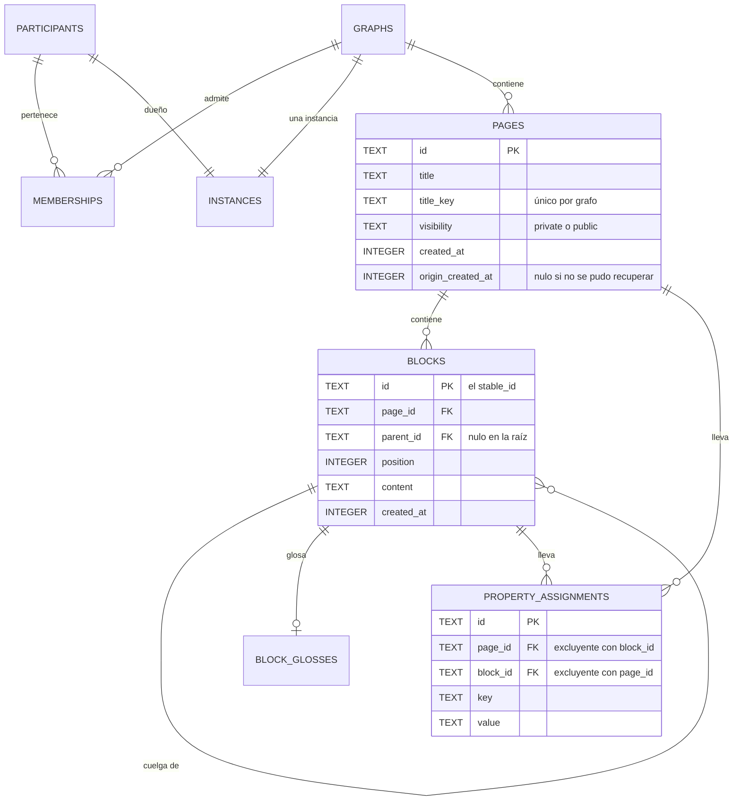
```mermaid
erDiagram
    PARTICIPANTS ||--o{ MEMBERSHIPS : "pertenece"
    GRAPHS ||--o{ MEMBERSHIPS : "admite"
    GRAPHS ||--|| INSTANCES : "una instancia"
    PARTICIPANTS ||--|| INSTANCES : "dueño"
    GRAPHS ||--o{ PAGES : "contiene"
    PAGES ||--o{ BLOCKS : "contiene"
    BLOCKS ||--o{ BLOCKS : "cuelga de"
    BLOCKS ||--o| BLOCK_GLOSSES : "glosa"
    PAGES ||--o{ PROPERTY_ASSIGNMENTS : "lleva"
    BLOCKS ||--o{ PROPERTY_ASSIGNMENTS : "lleva"

    PAGES {
        TEXT id PK
        TEXT title
        TEXT title_key "único por grafo"
        TEXT visibility "private o public"
        INTEGER created_at
        INTEGER origin_created_at "nulo si no se pudo recuperar"
    }
    BLOCKS {
        TEXT id PK "el stable_id"
        TEXT page_id FK
        TEXT parent_id FK "nulo en la raíz"
        INTEGER position
        TEXT content
        INTEGER created_at
    }
    PROPERTY_ASSIGNMENTS {
        TEXT id PK
        TEXT page_id FK "excluyente con block_id"
        TEXT block_id FK "excluyente con page_id"
        TEXT key
        TEXT value
    }
```

### El registro

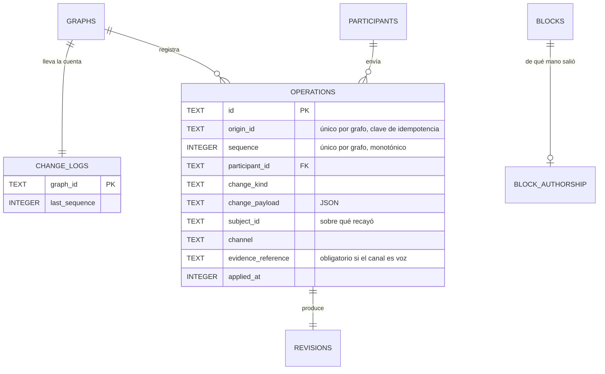
```mermaid
erDiagram
    GRAPHS ||--|| CHANGE_LOGS : "lleva la cuenta"
    GRAPHS ||--o{ OPERATIONS : "registra"
    OPERATIONS ||--|| REVISIONS : "produce"
    PARTICIPANTS ||--o{ OPERATIONS : "envía"
    BLOCKS ||--o| BLOCK_AUTHORSHIP : "de qué mano salió"

    OPERATIONS {
        TEXT id PK
        TEXT origin_id "único por grafo, clave de idempotencia"
        INTEGER sequence "único por grafo, monotónico"
        TEXT participant_id FK
        TEXT change_kind
        TEXT change_payload "JSON"
        TEXT subject_id "sobre qué recayó"
        TEXT channel
        TEXT evidence_reference "obligatorio si el canal es voz"
        INTEGER applied_at
    }
    CHANGE_LOGS {
        TEXT graph_id PK
        INTEGER last_sequence
    }
```

Los dos índices únicos de `operations` son la arquitectura entera en dos líneas:
`(graph_id, origin_id)` hace que reenviar sea inocuo y `(graph_id, sequence)`
hace que el registro tenga un orden que nadie puede reescribir.

### Lo derivado

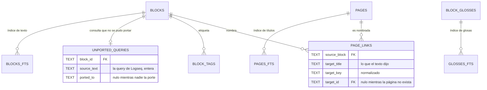
```mermaid
erDiagram
    BLOCKS ||--o{ PAGE_LINKS : "nombra"
    PAGES ||--o{ PAGE_LINKS : "es nombrada"
    BLOCKS ||--o{ BLOCK_TAGS : "etiqueta"
    BLOCKS ||--o| UNPORTED_QUERIES : "consulta que no se pudo portar"
    BLOCKS ||--o{ BLOCKS_FTS : "índice de texto"
    PAGES ||--o{ PAGES_FTS : "índice de títulos"
    BLOCK_GLOSSES ||--o{ GLOSSES_FTS : "índice de glosas"

    PAGE_LINKS {
        TEXT source_block FK
        TEXT target_title "lo que el texto dijo"
        TEXT target_key "normalizado"
        TEXT target_id FK "nulo mientras la página no exista"
    }
    UNPORTED_QUERIES {
        TEXT block_id FK
        TEXT source_text "la query de Logseq, entera"
        TEXT ported_to "nulo mientras nadie la porte"
    }
```

Las tres tablas FTS5 son *externas*: el contenido vive en las tablas de verdad y
los índices se mantienen con `TRIGGER`. Nadie escribe en ellas a mano.

Las 30 queries de Logseq que no se pudieron portar están en `unported_queries`
con su texto original, en vez de haber desaparecido en silencio.

### Identidad, cerco y exposición

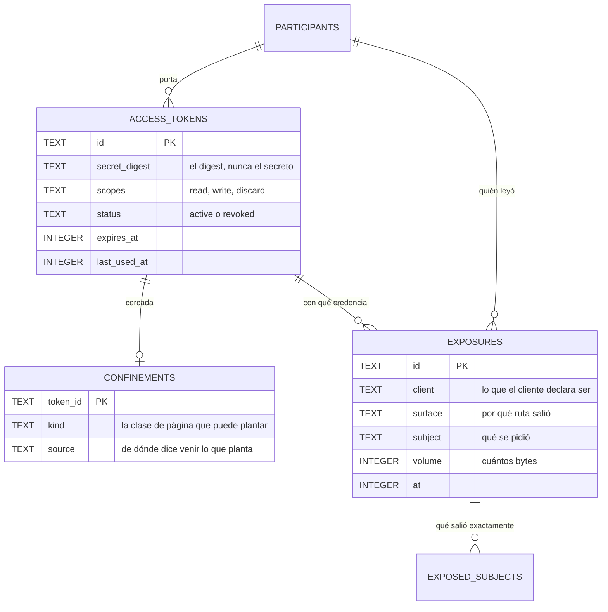
```mermaid
erDiagram
    PARTICIPANTS ||--o{ ACCESS_TOKENS : "porta"
    ACCESS_TOKENS ||--o| CONFINEMENTS : "cercada"
    ACCESS_TOKENS ||--o{ EXPOSURES : "con qué credencial"
    PARTICIPANTS ||--o{ EXPOSURES : "quién leyó"
    EXPOSURES ||--o{ EXPOSED_SUBJECTS : "qué salió exactamente"

    ACCESS_TOKENS {
        TEXT id PK
        TEXT secret_digest "el digest, nunca el secreto"
        TEXT scopes "read, write, discard"
        TEXT status "active o revoked"
        INTEGER expires_at
        INTEGER last_used_at
    }
    CONFINEMENTS {
        TEXT token_id PK
        TEXT kind "la clase de página que puede plantar"
        TEXT source "de dónde dice venir lo que planta"
    }
    EXPOSURES {
        TEXT id PK
        TEXT client "lo que el cliente declara ser"
        TEXT surface "por qué ruta salió"
        TEXT subject "qué se pidió"
        INTEGER volume "cuántos bytes"
        INTEGER at
    }
```

- **Se guarda el digest y no el secreto.** Una credencial se enseña una vez, al
  emitirla, y no vuelve a poder leerse.
- **`discard` va aparte de `write`** porque borrar es el único acto que el grafo
  no puede enseñarte después.
- **`exposed_subjects` guarda qué salió exactamente**, no sólo qué se pidió: una
  búsqueda que devolvió doce extractos expuso doce cosas, y el registro tiene que
  poder nombrarlas.

### Medios, voz y sitio

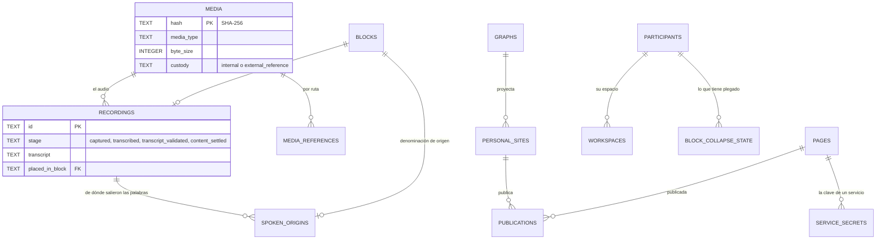
```mermaid
erDiagram
    MEDIA ||--o{ RECORDINGS : "el audio"
    MEDIA ||--o{ MEDIA_REFERENCES : "por ruta"
    RECORDINGS ||--o{ SPOKEN_ORIGINS : "de dónde salieron las palabras"
    BLOCKS ||--o| SPOKEN_ORIGINS : "denominación de origen"
    BLOCKS ||--o| RECORDINGS : "le guarda el sitio"
    GRAPHS ||--o{ PERSONAL_SITES : "proyecta"
    PERSONAL_SITES ||--o{ PUBLICATIONS : "publica"
    PAGES ||--o{ PUBLICATIONS : "publicada"
    PARTICIPANTS ||--o{ WORKSPACES : "su espacio"
    PARTICIPANTS ||--o{ BLOCK_COLLAPSE_STATE : "lo que tiene plegado"
    PAGES ||--o{ SERVICE_SECRETS : "la clave de un servicio"

    MEDIA {
        TEXT hash PK "SHA-256"
        TEXT media_type
        INTEGER byte_size
        TEXT custody "internal o external_reference"
    }
    RECORDINGS {
        TEXT id PK
        TEXT stage "captured, transcribed, transcript_validated, content_settled"
        TEXT transcript
        TEXT placed_in_block FK
    }
```

`media` y `recordings` sostienen el camino de la voz. `personal_sites` y
`publications` sostienen la publicación explícita: dirección, autoría, fecha y
portada; de ellas se construye la proyección HTML estática.

---

## 12. Registro canónico y materialización

La regla que gobierna todo lo demás, dicha una vez:

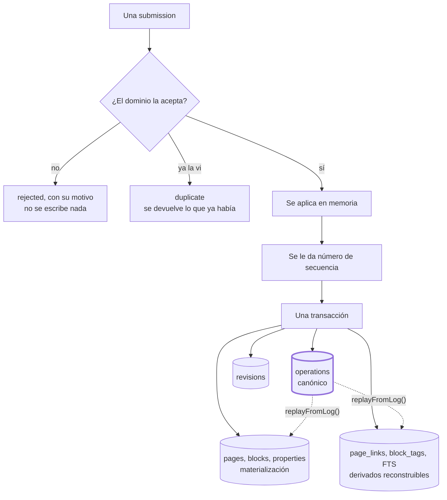
```mermaid
flowchart TB
    sub["Una submission"] --> val{"¿El dominio la acepta?"}
    val -->|"no"| rej["rejected, con su motivo<br/>no se escribe nada"]
    val -->|"ya la vi"| dup["duplicate<br/>se devuelve lo que ya había"]
    val -->|"sí"| ap["Se aplica en memoria"]

    ap --> seq["Se le da número de secuencia"]
    seq --> tx["Una transacción"]

    tx --> ops[("operations<br/>canónico")]
    tx --> rev[("revisions")]
    tx --> est[("pages, blocks, properties<br/>materialización")]
    tx --> der[("page_links, block_tags, FTS<br/>derivados reconstruibles")]

    ops -.->|"replayFromLog()"| est
    ops -.->|"replayFromLog()"| der

    classDef canon stroke-width:3px
    class ops canon
```

- **`operations` es el registro canónico.** Las tablas de estado son su
  materialización y los índices derivados son reconstruibles. Nada fuera de
  `submitOperation()` escribe en ellas.
- **Reproducir el registro no vuelve a derivar identidades.** La reproducción
  trae el `subjectId`, la `sequence` y el `operationId` que ya se escribieron:
  volver a contarlos parece lo mismo y no lo es. Basta un hueco en el registro
  —una operación aceptada que no se pudo guardar— para que la cuenta quede por
  detrás del último número escrito y la siguiente escritura reclame un número
  que ya existe; la base lo rechaza, esa operación tampoco se guarda, y el hueco
  crece: un corpus que se estropea más cuanto más se usa.
- **Si persistir falla, la memoria vuelve a ser la del disco.** El dominio ya
  había aplicado el cambio cuando la escritura falló, y la transacción sólo
  revierte el disco. Sin recargar, quedaba un bloque que existía en memoria y en
  ninguna parte más: se dibujaba como cualquier otro, todo lo que colgara de él
  fallaba con un error que hablaba de otra cosa, y al reiniciar desaparecía sin
  que nadie hubiera borrado nada.

El servidor mantiene el grafo entero en memoria y sirve desde ahí; SQLite es el
registro y la materialización, no la estructura de consulta en caliente. Para un
corpus personal de 48.000 bloques, eso cabe de sobra y elimina una capa entera de
traducción entre la spec y el comportamiento observable.

---

## 13. El camino de una escritura

El diagrama central del proyecto. `@invariant TheHandNeverWaitsForTheNetwork`:
un gesto se aplica en casa y se dibuja desde casa; la red viene después a poner
de acuerdo lo ya hecho.

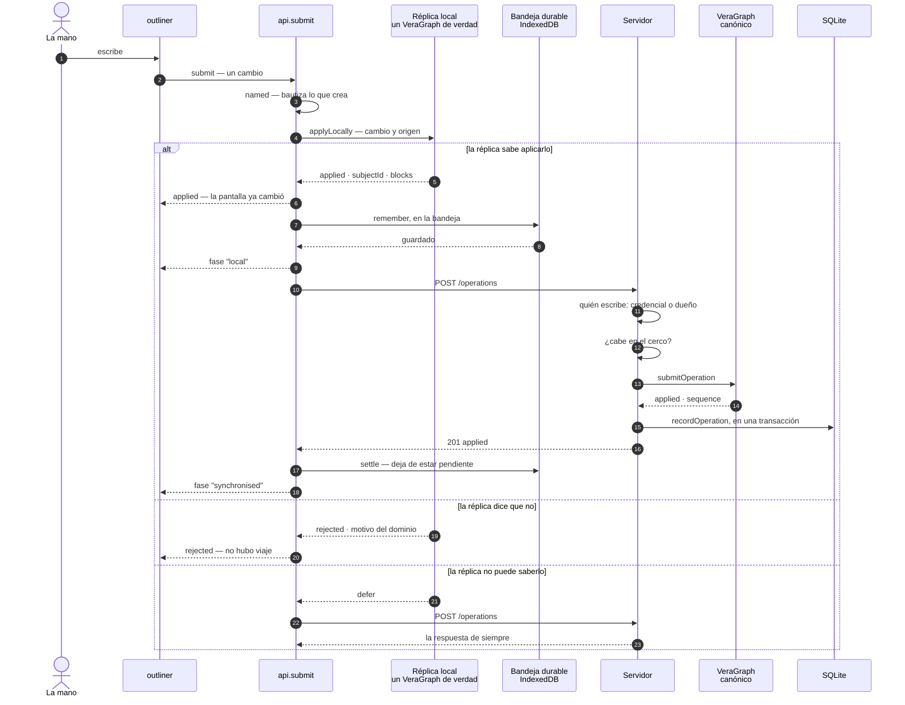
```mermaid
sequenceDiagram
    autonumber
    actor mano as La mano
    participant ol as outliner
    participant api as api.submit
    participant rep as Réplica local<br/>un VeraGraph de verdad
    participant ban as Bandeja durable<br/>IndexedDB
    participant srv as Servidor
    participant dom as VeraGraph<br/>canónico
    participant db as SQLite

    mano->>ol: escribe
    ol->>api: submit — un cambio
    api->>api: named — bautiza lo que crea
    api->>rep: applyLocally — cambio y origen

    alt la réplica sabe aplicarlo
        rep-->>api: applied · subjectId · blocks
        api-->>ol: applied — la pantalla ya cambió
        api->>ban: remember, en la bandeja
        ban-->>api: guardado
        api-->>ol: fase "local"
        api->>srv: POST /operations
        srv->>srv: quién escribe: credencial o dueño
        srv->>srv: ¿cabe en el cerco?
        srv->>dom: submitOperation
        dom-->>srv: applied · sequence
        srv->>db: recordOperation, en una transacción
        srv-->>api: 201 applied
        api->>ban: settle — deja de estar pendiente
        api-->>ol: fase "synchronised"
    else la réplica dice que no
        rep-->>api: rejected · motivo del dominio
        api-->>ol: rejected — no hubo viaje
    else la réplica no puede saberlo
        rep-->>api: defer
        api->>srv: POST /operations
        srv-->>api: la respuesta de siempre
    end
```

Cuatro decisiones que este camino encierra:

- **La identidad se acuña en el aparato.** `mint('block')` produce
  `block:<uuid>`, que no puede chocar con los identificadores contados del
  servidor ni mover su contador. Sin esto, crear algo obliga a preguntar cómo se
  llama lo creado, y preguntar es esperar.
- **Y se acuña *siempre*, antes de aplicar.** Costó verlo una vez en el
  navegador: la réplica llamaba al bloque nuevo `block:1` y el servidor lo
  llamaba `block:8`; se escribía una palabra dentro, la pantalla la enseñaba, y
  el servidor rechazaba la edición con «no such block». La palabra se perdía y la
  pantalla seguía enseñándola.
- **Las negativas locales son las del dominio.** No hay una comprobación
  paralela en el cliente: es el mismo código. Si el cliente decidiera por su
  cuenta qué es un `move_block` válido, tarde o temprano diría que sí donde el
  servidor dice que no, y quien escribe vería su bloque moverse y volver.
- **«Guardado» no se dice antes de que sea verdad.** `@invariant
  LocalDurabilityPrecedesSavedFeedback`: aplicar no espera a la bandeja —la mano
  ya siguió—; lo que espera es la *afirmación* de que está a salvo.

Lo que la réplica **no** sabe aplicar se difiere, y no es una optimización sino
una condición de corrección: media docena de sitios escriben en páginas que no
son la abierta —la tabla de la puerta MCP, la de una conexión de servicio,
promover un rastro— y contestarles «no such block» sería inventar una negativa
sobre algo que existe.

| Cambio | ¿En casa? | Por qué |
| --- | --- | --- |
| `create_block`, `edit_block`, `move_block`, `remove_block` | sí, si el sujeto vive en la página abierta | empieza y termina dentro de la réplica |
| `set_property`, `remove_property` | igual | idem |
| `create_page`, `rename_page`, `remove_page` | no, se difiere | tocan los enlaces que la nombran desde otras páginas, que esta réplica no tiene |
| cualquiera sobre otra página | no, se difiere | «no lo tengo» y «no existe» son la misma observación aquí, y sólo una es motivo para negarse |

---

## 14. Estados de un cambio pendiente

```mermaid
stateDiagram-v2
    [*] --> local : aplicado en casa y guardado
    local --> sending : le toca salir
    sending --> [*] : 201 o 200 duplicate — settle
    sending --> rejected : 422 del dominio
    sending --> local : no llegó — se reintenta al volver la red
    rejected --> [*] : una persona decide qué hacer
    local --> retenido : hay un desacuerdo sin resolver
    retenido --> local : resuelto — y ahora sí sale

    note right of local
        Sobrevive a cerrar la pestaña.
        Al abrir, lo que quedó en "sending"
        vuelve a "local": reenviar es inocuo.
    end note

    note right of retenido
        No se descarta ni se marca rechazado:
        se queda intacto donde está.
        Retener no es perder.
    end note

    note right of rejected
        No se borra y no se reintenta.
        PreserveRejectedLocalChange: lo que el
        dominio rechazó sigue siendo trabajo
        de alguien.
    end note
```

Y lo que se dice del conjunto, que no se adivina por la demora:

```mermaid
flowchart LR
    p["Lo pendiente"] --> r{"¿Hay algo rechazado?"}
    r -->|"sí"| att["attention_required"]
    r -->|"no"| w{"¿Queda algo esperando?"}
    w -->|"sí"| c{"¿Hay red?"}
    c -->|"sí"| loc["local"]
    c -->|"no"| off["offline"]
    w -->|"no"| u{"¿Espera trabajo ajeno?"}
    u -->|"sí"| upd["updates_waiting"]
    u -->|"no"| sync["synchronised"]
```

Se mira el rechazo primero: pide atención aunque todo lo demás esté al día.
`@invariant SilenceNeverPretendsToBeSuccess`. Y `updates_waiting` va después de lo
propio, porque lo que uno tiene sin mandar pesa más que lo que otro ya mandó.

Lo pendiente sale **de uno en uno y en su orden**, porque el orden es parte de
lo que se está mandando: crear un bloque y escribir dentro sólo tienen sentido
juntos, y en paralelo el segundo llegaría a un sitio que todavía no existe. No
hay reintento con espera creciente: quien vuelve a intentarlo es el navegador
cuando avisa de que hay red otra vez, y mientras tanto insistir sólo gastaría
batería.

---

## 15. Leer: lo retenido primero

La doctrina de retención: **nada se replica por adelantado, lo que se leyó se
queda**. Acotado a 240 páginas, y se suelta la que hace más que no se lee.

Lo que cambió, y es el cambio de fondo de esta versión: **lo retenido ya no es el
plan B**. Se dibuja siempre que exista, con servidor o sin él, y la red va detrás.
`@guarantee LocalFirstMeansFirst` estaba escrita desde el principio y el código no
la cumplía: `openPage()` pedía la página entera cada vez —la hubiera visitado una
o cincuenta— y lo retenido sólo se consultaba en el `catch`, es decir nunca,
porque un `catch` no se dispara porque algo tarde.

```mermaid
sequenceDiagram
    autonumber
    actor p as Quien lee
    participant app as PWA
    participant held as Retención<br/>IndexedDB "vera-held"
    participant srv as Servidor

    p->>app: abre una página
    app->>held: ¿la tienes?

    alt está retenida
        held-->>app: la vista que se guardó
        app-->>p: dibujada al instante, marcada como retenida
        app->>held: toca la fecha de lectura
    else no está
        app->>srv: GET /pages/:id
        srv-->>app: la página
        app->>held: keepPage — leerla es lo que la retiene
        held->>held: si son más de 240,<br/>suelta las menos recientes
        app-->>p: dibujada
    end

    Note over app,srv: y detrás, la pregunta barata
    app->>held: ¿hasta dónde sé del registro?
    held-->>app: el cursor
    app->>srv: GET /ops?since=cursor
    srv-->>app: qué pasó, y a qué página tocó
    app-->>p: si algo espera, el aviso lo dice
```

Dos cifras, medidas sobre el corpus real, que explican por qué la pregunta puede
ser continua y la respuesta no:

| | Cuesta | Pesa |
| --- | --- | --- |
| «¿qué ha pasado desde mi cursor?» | 0,003 s | 3,8 KB |
| una página muy escrita | 0,81 s | 512 KB |

Ciento treinta veces más ligero. `@guarantee KnowingIsCheapAndTakingIsNot`.

Lo que se retiene se **marca**. Una página servida de retención dice que lo es,
porque leer algo viejo creyéndolo actual es peor que no leerlo. El mapa del
grafo, que no se retiene, se dibuja con lo último que tuvo y lo dice.

---

## 16. Lo que espera, y quién decide traerlo

En este corpus escribe más de una mano —ver [la puerta MCP](#20-la-puerta-mcp) y
las credenciales de agente—, así que una página puede moverse mientras se la lee.
Ante eso sólo caben tres cosas, y dos son inaceptables:

```mermaid
flowchart TB
    hecho["Otra mano escribió<br/>mientras alguien leía"] --> q{"¿Qué hace Vera?"}
    q -->|"cambiar el texto<br/>bajo los ojos de quien lee"| a["No es sincronizar:<br/>es interrumpir"]
    q -->|"callarlo"| b["Lo único que<br/>SilenceNeverPretendsToBeSuccess<br/>prohíbe"]
    q -->|"decirlo y dejar<br/>que el dueño elija cuándo"| c["Cuesta un botón"]

    c --> d["Y de ahí se sigue algo:<br/>una página se puede leer<br/>sabiéndola desactualizada"]

    classDef malo stroke-dasharray: 5 5,color:#888
    class a,b malo
```

El aviso no cuenta lo mismo según dónde haya pasado, porque no es la misma
pregunta: lo que se movió en otra parte del corpus puede esperar callado; lo que
se movió aquí es lo que se está mirando.

```mermaid
stateDiagram-v2
    [*] --> synchronised : nada espera
    synchronised --> updates_waiting : GET /ops trajo trabajo ajeno
    updates_waiting --> updates_waiting : "algo nuevo · 3"<br/>nada de esta página cambió
    updates_waiting --> aqui : una de ellas tocó la página abierta
    aqui --> aqui : "cambió aquí · 1"<br/>y el aviso pregunta
    aqui --> trayendo : lo pulsan
    updates_waiting --> trayendo : lo pulsan
    trayendo --> synchronised : sin desacuerdo
    trayendo --> desacuerdo : dos manos, un bloque
    desacuerdo --> synchronised : resuelto
    desacuerdo --> updates_waiting : se dejó para después
```

Traerlo es un camino con orden, y el orden importa:

```mermaid
sequenceDiagram
    autonumber
    actor p as Quien lee
    participant app as PWA
    participant ban as Bandeja
    participant held as Retención
    participant srv as Servidor

    p->>app: pulsa el aviso
    app->>held: suelta las retenidas que dejaron de valer
    app->>srv: GET /pages/:id — la abierta, con plazo de 10 s
    srv-->>app: cómo está ahora
    app->>ban: ¿qué hay pendiente sobre estos bloques?
    ban-->>app: lo que aún no ha salido

    alt las dos manos tocaron el mismo bloque
        app-->>p: el diálogo del desacuerdo
        p-->>app: qué se queda
        app->>ban: lo decidido
    end

    app->>held: avanza el cursor
    app->>srv: y ahora sí, sale lo pendiente
```

**Lo propio no se anuncia a sí mismo.** El registro canónico es uno solo, así que
lo que este aparato mandó vuelve en la misma respuesta; se reconoce por su
`originId` —la misma llave de idempotencia de siempre— y se descarta. Sin eso,
Vera avisaría de que la página cambió cada vez que uno escribe en ella.

**Y lo pendiente no sale mientras haya una decisión pendiente.** `api.holdsBack`
retiene la bandeja hasta que el desacuerdo se resuelva. Se vio en el navegador y
no en una prueba: al volver la red, el drenaje le ganaba la carrera a la pregunta
y una edición propia pisaba en silencio la ajena.

---

## 17. El desacuerdo

Dos manos escribieron el mismo bloque y ninguna está equivocada.

```mermaid
flowchart LR
    d["Un bloque<br/>que las dos tocaron"] --> v1["Lo de aquí,<br/>todavía sin mandar"]
    d --> v2["Lo que el corpus<br/>dice ahora"]
    v1 --> muestra["Las líneas que difieren,<br/>marcadas"]
    v2 --> muestra
    muestra --> elige{"Se elige por bloque"}
    elige --> k1["quedarse con lo de uno"]
    elige --> k2["tomar lo del corpus"]
    elige --> k3["escribir una tercera cosa"]
    elige --> k4["dejarlo para después"]

    k4 --> nada["No se aplica nada.<br/>Lo pendiente sigue pendiente<br/>y el aviso sigue encendido"]
```

**La unidad es el bloque, y eso no es una decisión de dibujo.** El bloque es lo
único de lo que Vera tiene identidad: una línea no tiene nombre, ni autor, ni
historia. Una resolución escogida línea a línea dejaría un texto que no escribió
ninguna de las dos manos, en un bloque cuya autoría ya no se puede afirmar — y en
un corpus donde también escribe una máquina, «quién dijo esto» tiene que
sobrevivir a resolver un desacuerdo.

Las líneas que difieren **se enseñan**, porque elegir entre dos versiones sin ver
en qué difieren es elegir a ciegas. Se enseñan; no se eligen.

La tercera salida —escribir otra cosa— no es un lujo: cuando cada versión dice
algo que la otra no dice, quedarse con una es perder texto, y perder texto en
silencio es lo que todo esto existe para impedir.

Y no todo lo que cambió es un desacuerdo: **sólo lo que está pendiente aquí y
además se movió allá**. Lo demás es simplemente lo nuevo y se toma sin preguntar,
porque preguntar por cada bloque que otra mano tocó convertiría una decisión en
cincuenta.

---

## 18. La espera, cuando la hay

`specs/waiting.allium`. La doctrina, en cinco frases: **nunca se anima; se
cuenta el tiempo transcurrido; nunca un porcentaje; se recuerda la mediana de
las últimas siete duraciones; sólo se recuerda lo que salió bien.**

```mermaid
stateDiagram-v2
    [*] --> trabajando : empieza un trabajo con nombre
    trabajando --> silencio : menos de 900 ms
    silencio --> [*] : terminó y nadie se enteró
    trabajando --> contando : pasados 900 ms
    contando --> contando : "12 s · suele tardar 40 s"
    contando --> pasado : se pasó de lo habitual
    pasado --> pasado : "58 s" — se deja de prometer
    contando --> [*] : terminó
    pasado --> [*] : terminó
```

| Regla | Por qué |
| --- | --- |
| El contador aparece donde estaba la mano | `@guarantee TheCountIsWhereTheGestureWas` — no en una esquina de estado |
| Bajo 900 ms no se indica nada | un parpadeo de «cargando» cuesta más atención que la espera |
| «suele tardar» sale de medir, no de estimar | mediana de las últimas siete veces que ese mismo trabajo salió bien |
| Pasado lo habitual se deja de decir | seguir diciéndolo sería seguir prometiendo algo que ya se incumplió |
| Sólo lo que salió bien se recuerda | la duración de un fallo no dice cuánto tarda el trabajo |
| Una espera sin nombre no se recuerda | sin clave no hay a qué comparar |

---

## 19. Deshacer

Vera no lleva una pila de deshacer, y no le hace falta: el registro ya tiene
todos los estados anteriores de todo. Deshacer es **calcular la operación
contraria leyendo el registro hacia atrás y aplicarla como cualquier otra
escritura**.

```mermaid
sequenceDiagram
    autonumber
    actor p as Quien deshace
    participant app as PWA
    participant srv as GET /undo
    participant log as El registro
    participant dom as VeraGraph

    p->>app: Ctrl+Z
    app->>srv: ¿qué se desharía?
    srv->>log: el último gesto de esta mano
    log-->>srv: una tanda seguida de operaciones
    srv->>srv: invierte cada una, en orden inverso
    srv-->>app: esto es lo que se desharía
    app-->>p: lo enseña
    p->>app: sí
    app->>srv: POST /undo
    srv->>dom: aplica las contrarias
    dom->>log: quedan registradas, con su autor
```

Dos consecuencias que valen el diseño entero:

- **No se borra nada del registro.** Deshacer añade, como todo lo demás, y por
  eso queda dicho quién deshizo y cuándo. Un deshacer que borrara del log
  rompería la única promesa que sostiene todo: que lo que pasó se puede volver a
  leer.
- **Deshacer se puede deshacer, sin código nuevo.** La operación contraria es
  una operación, y la suya se calcula igual.

**«Lo último» es un gesto, no una operación.** Escribir «hola» es una
operación; unir dos bloques con un retroceso son cinco —tres mudanzas de hijos,
un texto pegado y un bloque borrado— y quien pulsó una tecla espera deshacer una
cosa. Un gesto es una tanda seguida de operaciones de la misma mano; la pausa que
las separa se mide y no se declara: es lo que separa dos intenciones.

---

## 20. La puerta MCP

Un proceso por cliente, lanzado por el cliente, hablando por tuberías. Sin
puerto, sin red y sin nada escuchando: mientras la puerta sea ésta, el problema
de exponer la memoria de alguien a internet no existe todavía.

```mermaid
sequenceDiagram
    autonumber
    participant cli as Cliente MCP<br/>Claude, Codex, Gemini
    participant proc as @vera/mcp<br/>proceso stdio
    participant api as API HTTP
    participant reg as Registro de exposición
    participant dom as El corpus

    cli->>proc: initialize
    proc-->>cli: instrucciones — qué es esto y qué NO se puede
    cli->>proc: tools/list
    proc-->>cli: nueve herramientas, incluida escritura cercada
    cli->>proc: vera_buscar("accesibilidad")
    proc->>api: GET /search?q=...
    api->>api: ¿quién llega? credencial o dueño
    api->>reg: anota ANTES de responder
    api->>dom: graph.search()
    dom-->>api: extractos
    api-->>proc: extractos, con página y bloque
    proc-->>cli: los extractos, citables por título
```

- **Se anota antes de escribir en el cable.** `@invariant
  NoDeliveryWithoutItsRecord`: al revés, un proceso que se cae entre responder y
  anotar convierte una lectura en una lectura invisible, que es justo lo que este
  registro existe para que no pase.
- **Un intento rechazado no se anota como exposición.** Ahí no salió nada, y
  anotarlo exigiría ponerle un participante —la columna no admite vacío— y el
  único a mano sería el dueño: exactamente la mentira que hay que evitar.
- **Mirar el registro no se anota a sí mismo**, o el registro crecería cada vez
  que se abre y dejaría de ser sobre el corpus.
- **No hay caché.** Lo que MCP entrega es lo que el corpus dice ahora, no lo que
  decía cuando el proceso arrancó.
- **El secreto nunca sale de `argv`.** Los argumentos de un proceso los lee
  cualquiera con un `ps`, y una credencial que se puede leer con `ps` es una
  credencial de todos: viene del entorno o de un archivo.

La puerta se gobierna desde **una sola página** del corpus, y no una por
cliente: MCP es una puerta y muchos entran por ella. Zotero es la dirección
contraria —Vera sale a buscar— y ahí sí una página por servicio.

---

## 21. El cerco de una credencial

Una credencial cercada escribe **sin que nadie revise**, a cambio de no poder
salir de casa. Es el trato: autonomía a cambio de alcance.

```mermaid
flowchart TB
    op["POST /operations<br/>con una credencial"] --> id{"¿La credencial vive?"}
    id -->|"no"| n401["401"]
    id -->|"sí"| sc{"¿Tiene el alcance<br/>para esta clase de cambio?"}
    sc -->|"no"| n403["403, diciendo qué falta"]
    sc -->|"sí"| f{"¿Está cercada?"}
    f -->|"no"| dom["Al dominio"]
    f -->|"sí"| ck{"¿El cambio cabe en el cerco?"}

    ck -->|"crea una página<br/>de su clase"| ok1["sí"]
    ck -->|"escribe dentro de una<br/>que ella plantó"| ok2["sí"]
    ck -->|"borra algo"| no1["no — un cerco no borra"]
    ck -->|"escribe en una página<br/>de otro"| no2["no"]

    ok1 --> dom
    ok2 --> dom
    no1 --> n403
    no2 --> n403

    dom --> nace{"¿Nació una página<br/>bajo un cerco?"}
    nace -->|"sí"| marca["Vera le pone la clase y la fuente<br/>como operaciones suyas"]
    nace -->|"no"| fin["Aplicada"]
    marca --> fin
```

- **`@invariant TheFenceIsInTheCredentialAndNotInTheDoor`** — se comprueba en la
  única puerta de escritura y no en la herramienta MCP. El mismo secreto entra
  por la API sin pasar por ninguna herramienta, y un límite que sólo comprueba la
  herramienta es una sugerencia dirigida a quien ya decidió obedecerla.
- **`@invariant TheKindAndTheSourceComeFromTheFence`** — la clase y la fuente las
  pone Vera y no viajan en el cambio. Un agente que pudiera mandarlas escribiría
  una página que dice ser de otra clase y venir de otra parte, que es justamente
  lo que el cerco existe para fijar.
- **Las negativas dicen por qué.** `@guarantee RefusalsSayWhy`: qué cerco es y
  qué quedaba fuera. Perder eso para dejar sólo «403» obligaría a abrir la
  consola de red para saber qué pasó.

---

## 22. Importación y proyección

Dos direcciones que no son simétricas, y conviene que se vea.

```mermaid
flowchart LR
    subgraph entrada["Entrada — se lee en sólo lectura"]
        ls["Archivos Logseq"]
        doc["Un documento<br/>docx, pdf, md"]
    end

    ls --> parse["parseLogseqPage"]
    doc --> struct["Lectura estructural"]
    parse --> ch["Cambios con canal import"]
    struct --> ch
    ch --> dom["submitOperation"]
    dom --> db[("SQLite")]
    parse --> loss["Reporte de pérdida<br/>qué no se pudo leer"]

    db --> proj["projectGraph"]
    proj --> md["Markdown"]
    proj --> man["Manifiesto<br/>stable_id ↔ ruta"]
    md --> git["git"]
    man --> git

    git -.->|"NO vuelve"| db

    classDef una stroke-dasharray: 5 5,color:#888
    class git una
```

- **La importación nunca escribe en el corpus de partida** y es repetible, para
  poder comparar el resultado cuantas veces haga falta.
- **Nada entra por otra vía**: el corpus importado queda con la misma
  procedencia que cualquier otro cambio, canal `import`, y por tanto con su sitio
  en el registro.
- **Lo que se pierde se cuenta.** El `LossReport` dice cuántos archivos no se
  pudieron leer, qué páginas se rechazaron y por qué, cuántos `stable_id` se
  adoptaron y cuántos estados de plegado se descartaron. Una importación que
  perdiera cosas en silencio no sería una importación.
- **La proyección es de una sola dirección.** Markdown sale de la base; nunca
  vuelve. Y el determinismo es requisito duro: proyectar dos veces el mismo
  estado produce bytes idénticos, o el `git diff` deja de significar nada.
- **La correspondencia entre `stable_id` y ruta vive en un manifiesto**, fuera
  del texto. Los archivos proyectados no llevan UUID técnicos.

---

## 23. Búsqueda y consultas

Dos preguntas distintas con dos caminos distintos.

```mermaid
flowchart TB
    subgraph buscar["Buscar — texto"]
        q1["GET /search?q="] --> s1["graph.search()"]
        s1 --> h1["SearchHit<br/>página, bloque, campo, extracto, rango"]
        h1 --> n1["Se anota qué extractos salieron"]
    end

    subgraph preguntar["Preguntar — estructura"]
        q2["? tipo=proyecto + concepto=X<br/>+ ->[[Vera]] + !~borrador ; tabla"]
        q2 --> parse["readQuery — sintaxis compacta"]
        parse --> expr["QueryExpression<br/>título, contenido, etiqueta,<br/>propiedad, dirección de enlace"]
        expr --> comp["and · or · not"]
        comp --> res["Páginas, con una muestra<br/>de dónde lo dice"]
        parse -.->|"no se entiende"| err["error, con la posición<br/>y qué había cerca"]
    end
```

- **La búsqueda del servidor corre sobre el grafo en memoria.** Los índices FTS5
  existen, se mantienen solos con `TRIGGER` y hoy se ejercitan desde
  `@vera/store` y sus pruebas: son el camino para buscar sin cargar el grafo, y
  ese camino todavía no lo usa ninguna ruta.
- El vocabulario de consulta **está enumerado**: se puede descubrir qué es
  preguntable sin leer una gramática ni adivinar un dialecto.
- Una consulta que no se entiende **dice dónde**, no «error de sintaxis».

---

## 24. Procesar una página

Lo que un modelo local puede decir de una página, y lo que no puede hacer con
ella.

```mermaid
flowchart TB
    p["Una página"] --> a["Lectura estructural<br/><small>contando, sin modelo</small>"]
    p --> b["Puesta en forma<br/><small>cuatro transformaciones</small>"]
    p --> c["Menciones<br/><small>lo que nombra y el corpus ya tiene</small>"]
    p --> d["Lectura con modelo local<br/><small>si lo hay</small>"]

    a --> prop["Proposiciones"]
    b --> prop
    c --> prop
    d --> prop

    prop --> h{"Una persona decide"}
    h -->|"sí"| ap["Se aplican como cambios"]
    h -->|"no"| ig["La página queda exactamente<br/>como estaba"]
```

- **`@invariant ProcessingProposesAndNothingMore`** — lo que sale son
  sugerencias, y una página procesada y luego ignorada es exactamente la página
  que era.
- **`@invariant ItIsTheSameEveryTime`** — la lectura estructural no usa modelo,
  ni red, ni azar: entran los bloques y sale su estructura, y la misma página da
  lo mismo cada vez. Eso es lo que permite probar lo que afirma.
- **`@invariant TheModelIsLocalOrThereIsNone`** — un corpus no sale de casa para
  ser entendido. Donde no haya modelo se hace la parte que no lo necesita y se
  dice cuál no se pudo.
- **`@invariant EveryLinkIsHumanlyConfirmed`** — las menciones se proponen; el
  enlace lo pone una persona.

---

## 25. La voz

```mermaid
stateDiagram-v2
    [*] --> captured : MediaRecorder, con su evidencia
    captured --> transcribed : whisper.cpp, en esta máquina
    transcribed --> transcript_validated : una persona lo confirma
    transcript_validated --> content_settled : el texto ocupa su bloque
    content_settled --> [*]

    note right of captured
        La grabación prueba que alguien habló.
        canal authenticated_voice, y sin evidencia
        el dominio la rechaza.
    end note

    note right of transcript_validated
        La validación es una operación de Vera,
        no un efecto automático del transcriptor.
        Borrar el audio después, también.
    end note
```

El bloque conserva su **denominación de origen** aunque después lo reescriban:
`spoken_origins` dice de dónde vinieron las palabras y no cambia nunca;
`block_authorship` dice quién las escribió por última vez y cambia con cada
edición. Un bloque puede tener las dos y nombrar participantes distintos:
dictado por una persona, reescrito por un agente.

---

## 26. Servicios de fuera

Una conexión con algo de fuera no vive en un archivo de configuración: vive en
una página especial, que se lee y se edita como cualquier otra.

```mermaid
flowchart LR
    pag["Página con<br/>special-kind:: service"] --> qué["Qué servicio es"]
    pag --> bib["Con qué biblioteca habla"]
    pag --> trae["Qué se trae de ella"]
    pag -.-> sec[("service_secrets<br/>la única excepción")]

    trae --> z["Zotero"]
    z -->|"sólo lee"| items["Ítems bibliográficos"]
    items --> blo["Bloques en el corpus"]

    z -.->|"nunca escribe"| zno["La bibliografía se<br/>gobierna en Zotero"]

    classDef ausente stroke-dasharray: 5 5,color:#888
    class zno ausente
```

- **Todo lo gobernable vive en páginas.** La única excepción es un secreto, y
  por eso `service_secrets` es una tabla y no un bloque: lo demás de la conexión
  —qué es, con qué habla, qué trae— se ve porque una conexión que no se ve no se
  puede revisar.
- **`@guarantee ZoteroRemainsBibliographicAuthority`** — Vera lee y no escribe.
  La bibliografía se gobierna donde ya se gobernaba.

---

## 27. La PWA por dentro

TypeScript sobre el DOM, sin framework. No hay estado de componente que
justifique uno: la interfaz es un outliner y dos lienzos.

```mermaid
flowchart TB
    main["main.ts<br/><small>arranque, enrutado, apertura de páginas</small>"]

    main --> api["api.ts<br/><small>submit, send, drain</small>"]
    main --> rep["replica.ts<br/><small>VeraGraph local</small>"]
    main --> box["outbox.ts<br/><small>bandeja durable</small>"]
    main --> held["held.ts<br/><small>lo leído, el cursor,<br/>lo que salió de aquí</small>"]
    main --> beh["behind.ts<br/><small>qué espera y qué toca<br/>la página abierta</small>"]
    main --> rec["reconcile.ts<br/><small>el diálogo del desacuerdo</small>"]
    main --> wait["waiting.ts<br/><small>contar, no animar</small>"]
    main --> ol["outliner.ts<br/><small>el árbol de bloques</small>"]
    main --> g2["graph/render.ts<br/><small>mapa 2D — d3</small>"]
    main --> g3["graph/render3d.ts<br/><small>mapa 3D</small>"]
    main --> tok["tokens.ts<br/><small>tema, editable</small>"]

    ol --> car["caret.ts<br/><small>dónde cae el cursor<br/>y qué se mueve para verlo</small>"]
    ol --> keys["keys.ts"]
    ol --> ac["autocomplete.ts"]
    ol --> qb["query-block.ts"]
    ol --> mm["mermaid.ts"]
    ol --> tp["trail-page.ts"]
    ol --> sp["service-page.ts"]
    ol --> mp["mcp-page.ts"]
    ol --> vo["voice.ts"]
    ol --> ca["canvas.ts"]
    ol --> gt["governing-table.ts"]

    api --> core["@vera/core"]
    rep --> core

    sw["sw.js<br/><small>service worker</small>"] -.->|"cachea el armazón<br/>y nada más"| main
```

La decisión explícita del service worker: **no cachea respuestas de
`/operations` ni lecturas del grafo**. Servir grafo viejo sin poder escribir
sería peor que declarar que no hay red. Lo que sí sobrevive sin red es la
retención, que es otra cosa: se guarda deliberadamente, se marca al servirse, se
suelta por antigüedad de lectura —y también en cuanto se sabe que dejó de valer,
que es lo que un caché sin nadie a quien preguntarle no puede hacer.

Tres módulos de lógica pura, sin DOM y sin red, que por eso se prueban sin
navegador: `keys.ts` decide qué hace una tecla, `behind.ts` decide qué espera y
qué de ello toca lo que está en pantalla, y `caret.ts` decide dónde cae el cursor
y cuánto hay que desplazar para verlo. La medición y el dibujo se quedan fuera.

---

## 28. Las rutas HTTP

Sin generador de esquemas y con validación explícita en el borde. Toda ruta
resuelve **antes de enrutar** quién llega: una credencial muerta no abre ni una
página, ni el índice, ni la ontología.

```mermaid
flowchart TB
    req["Una petición"] --> who{"¿Quién llega?"}
    who -->|"credencial muerta"| n401["401 — no se anota nada"]
    who -->|"credencial viva"| rt["Enrutado"]
    who -->|"sin credencial"| rt

    rt --> w["Escritura<br/>POST /operations"]
    rt --> r["Lectura<br/>se anota lo que sale"]
    rt --> adm["Administración<br/>sólo el dueño"]
```

| Ruta | Qué hace |
| --- | --- |
| `GET /health` | qué es este corpus y cómo llama a sus propiedades |
| `GET /pages` · `GET /pages/:id` | el índice y una página entera |
| `GET /pages/:id/markdown` · `/paper` · `/pdf` | la página fuera de Vera |
| `POST /pages/:id/process` · `POST /blocks/:id/process` | proponer, sin decidir |
| `GET /search` · `POST /query` | buscar texto · preguntar por estructura |
| `GET /graph/:centre` | el vecindario |
| `GET /blocks/:id/history` | la historia de un bloque |
| `GET /glosses` | la marginalia |
| `POST /operations` | **la única puerta de escritura** |
| `GET /ops?since=` | el registro desde un cursor, **y a qué página tocó cada cambio** |
| `GET /invariants` | los invariantes de las specs, sobre el grafo real |
| `GET /ontology` | de qué está hecho este corpus |
| `GET`/`POST /undo` | qué se desharía · deshacerlo |
| `POST /folds` | plegar, que no es un cambio del grafo |
| `GET`/`PUT /workspace` | el espacio de trabajo de quien mira |
| `GET /special-pages` | las páginas que gobiernan algo |
| `POST /agents` | admitir un agente |
| `GET`/`POST /agents/credentials` | listar · emitir (el secreto, una vez) |
| `POST /agents/credentials/:id/revoke` | retirarla, sin tocar lo que escribió |
| `POST`/`DELETE /agents/credentials/:id/confinement` | cercar · liberar |
| `GET /agents/whoami` | quién es el portador y con qué alcances |
| `GET /mcp` · `POST /mcp/connections` | la puerta y cómo enchufarse a ella |
| `GET /exposures` | qué salió, hacia quién y cuándo |
| `POST /recordings` y sus rutas | capturar, transcribir, validar, colocar, descartar |
| `GET /services/*` | las conexiones de fuera |
| `POST /import` | traer un documento |
| `GET /media/*` | los objetos por hash |

`GET /invariants` sobre el corpus real devuelve `[]`.

---

## 29. De la spec al código

El método: **la spec primero, y las preguntas abiertas se dejan visibles**. Una
spec no es documentación de lo hecho; es lo que hay que cumplir, y el código se
anota con el invariante que sostiene.

```mermaid
flowchart LR
    q["Una pregunta sobre<br/>cómo debe comportarse Vera"] --> spec["specs/*.allium<br/>contract, rule, invariant"]
    spec --> chk["allium check"]
    spec --> code["El código, anotado<br/>@invariant NombreExacto"]
    code --> test["node --test<br/>+ fast-check"]
    test --> obl["docs/test-obligations.md<br/>qué NO cubre"]
    spec --> open["open question<br/>lo que sigue sin decidirse"]
    code -.->|"si divergen"| drift["Manda la spec"]
```

Los invariantes de `core.allium` están además **ejecutables** en
`packages/core/src/invariants.ts`, con el nombre exacto de la spec, de modo que
un fallo señale la línea que se violó y no una descripción aproximada. `GET
/invariants` los corre sobre el corpus real.

Las 33 specs, por lo que gobiernan:

```mermaid
mindmap
  root((specs))
    Dominio
      core
      change-application
      logseq-block-identity-reference
    Escritura
      block-editing
      block-gloss
      hand-drawing
      voice-capture
      tasks
      undo
    Lectura
      search-index
      query-language
      graph-navigation
      daily-log
      block-as-request
    Sentido
      controlled-ontology
      trail
      page-processing
      document-import
      bibliographic-integration
    Identidad
      identity-access
      agent-participation
      confined-writing
      mcp-server
      librarian-round
    Superficie
      workspace-interface
      offline-reconciliation
      waiting
      special-pages
      content-media
      executable-content-sandbox
      page-on-paper
      service-connections
      personal-site-projection
```

---

## Lo que todavía no existe

Marcado aparte a propósito: un documento que mezcla lo construido con lo
propuesto convierte una intención en un compromiso sin que nadie lo decida.

```mermaid
flowchart TB
    subgraph hecho["Construido"]
        h1["Registro de operaciones<br/>con clave de origen"]
        h2["Réplica local y bandeja durable"]
        h3["Retención de lo leído,<br/>y se dibuja primero"]
        h8["Cursor por aparato<br/>y lectura de lo que pasó"]
        h9["El desacuerdo, por bloque<br/>y con las dos versiones a la vista"]
        h4["Credenciales de agente y cercos"]
        h5["Puerta MCP de lectura"]
        h6["Proyección Markdown determinista"]
        h7["Registro de exposición"]
    end

    subgraph falta["Propuesto"]
        f1["Que un aparato empuje<br/>en vez de preguntar cada minuto"]
        f3["Passkeys para humanos<br/>— hoy nadie autentica al dueño"]
        f4["Autorización de lectura<br/>por alcance"]
        f5["Camino de propuestas<br/>escribir desde MCP"]
        f6["Sitio público estático"]
        f7["Almacén de medios<br/>y respaldo con restic"]
        f8["Canal de eventos"]
    end

    h1 --> h8
    h8 --> h9
    h8 --> f1
    f8 --> f1
    h4 --> f3
    f3 --> f4
    h5 --> f5
    h6 --> f6

    classDef propuesta stroke-dasharray: 5 5
    class f1,f3,f4,f5,f6,f7,f8 propuesta
```

El que más pesa, y por eso va primero: **v0 no autentica al dueño**. Quien llega
sin credencial se toma por él. Es aceptable mientras la instancia no escuche
fuera de la máquina, y deja de serlo el día que lo haga. Ver
[`plan-nadie-por-omision.md`](plan-nadie-por-omision.md).

Lo que sí cambió ya: esa vía no puede escribir *como otro*. Para firmar como
el bibliotecario hace falta la credencial del bibliotecario.

---

## Dónde seguir

| | |
| --- | --- |
| [Arquitectura](architecture.md) | las decisiones de stack, con lo descartado y por qué |
| [Anatomía de la interfaz](interfaz.md) | inventario de lo que hay en pantalla |
| [Obligaciones de prueba](test-obligations.md) | qué cubre la suite y sobre todo qué no |
| [`specs/`](../specs/) | lo que manda |
| [CONTRIBUTING.md](../CONTRIBUTING.md) | cómo se trabaja |
