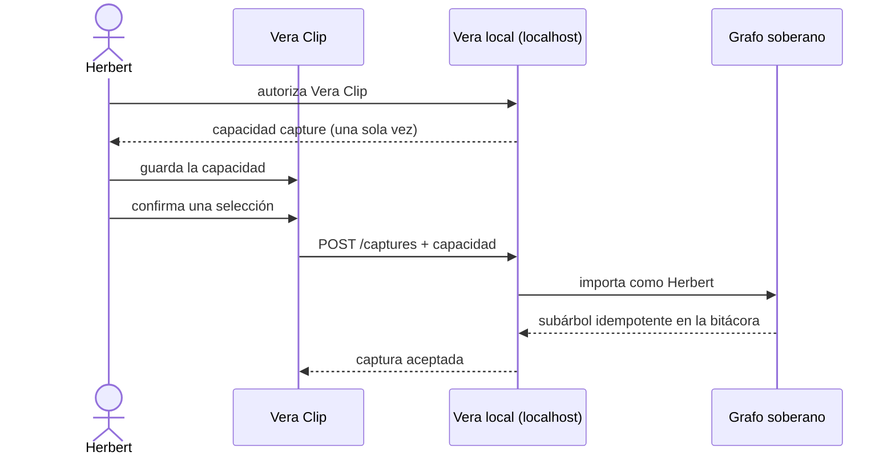

# Vera Clip: capturar en la Vera local

[Vera Clip](https://github.com/mediafranca/vera-clip) incorpora una selección o
un artículo legible desde el navegador a la bitácora de Vera. Cuando la
extensión y Vera Desktop viven en el mismo computador, la ruta normal es
directa por `http://127.0.0.1:4173`: la captura no sale a Internet.

## Identidad y procedencia

Vera Clip es una herramienta delegada por la persona propietaria, no un autor
independiente ni un agente. Una captura local queda, por tanto:

- atribuida a la persona propietaria de esa Vera;
- registrada por el canal `import`, porque las palabras vienen de una fuente;
- acompañada por URL, título, fecha y tipo de captura;
- limitada por una credencial cuyo único alcance es `capture`.

Esa credencial no permite leer, buscar, editar ni borrar el corpus. Identifica
la instalación técnica y puede revocarse sin alterar las capturas ya
incorporadas.

## Autorizar una instalación

1. Abre **MCP** en Vera y baja hasta **Capturas**.
2. Pulsa **autorizar Vera Clip**.
3. Copia el bloque de autorización; el secreto sólo se muestra esa vez.
4. En las opciones de Vera Clip, pégalo bajo **Esta Vera local** y guarda.
5. Si dejas de usar esa instalación, olvida la autorización en la extensión y
   revoca su credencial en Vera.

## Cuándo interviene Vera Conecta

Si el navegador está en otro dispositivo, o si la Vera local no está
disponible, Vera Clip puede usar como respaldo
[Vera Conecta](https://vera.mediafranca.net/vera-conecta/). El relay no es una
copia central de Vera: transporta el mismo sobre hasta Vera Desktop, que sigue
siendo la autoridad y escribe en el mismo grafo local.

La prioridad es siempre:

1. Vera local autenticada;
2. Vera Conecta, sólo si fue configurada como respaldo;
3. cola privada en el navegador hasta que alguno de los dos destinos vuelva.

## Contrato técnico

- `POST /mcp/connections` con trato `capturar` emite la capacidad delegada.
- `POST /captures` exige esa capacidad y rechaza una petición anónima.
- la capacidad queda ligada a la persona propietaria con alcance `capture`;
- los reintentos comparten una clave de idempotencia y no duplican el subárbol;
- la revocación invalida futuras capturas y conserva la historia anterior.

La especificación normativa es
[`specs/browser-capture.allium`](../specs/browser-capture.allium).
